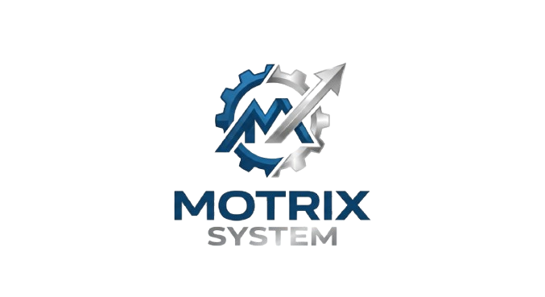

# 🚗 Motrix System - Sistema de Gestão para Oficinas Mecânicas



Sistema completo de gestão para oficinas mecânicas desenvolvido com **Quasar Framework** (Vue 3) e integrado com API REST.

## 📋 Índice

- [Sobre o Projeto](#sobre-o-projeto)
- [Funcionalidades](#funcionalidades)
- [Tecnologias Utilizadas](#tecnologias-utilizadas)
- [Pré-requisitos](#pré-requisitos)
- [Instalação](#instalação)
- [Configuração](#configuração)
- [Executando o Projeto](#executando-o-projeto)
- [Estrutura do Projeto](#estrutura-do-projeto)
- [Módulos do Sistema](#módulos-do-sistema)
- [API Integration](#api-integration)
- [Build e Deploy](#build-e-deploy)
- [Contribuindo](#contribuindo)
- [Licença](#licença)

---

## 🎯 Sobre o Projeto

O **Motrix System** é uma solução completa para gestão de oficinas mecânicas, permitindo o controle de:

- Ordens de serviço
- Cadastro de clientes e veículos
- Gerenciamento de usuários e permissões
- Controle de peças e mão de obra
- Geração de relatórios em PDF
- Histórico completo de serviços

O sistema foi desenvolvido com foco em usabilidade, performance e escalabilidade.

---

## ✨ Funcionalidades

### 🔐 Autenticação e Autorização

- Login seguro com JWT
- Controle de permissões (Admin/Usuário)
- Proteção de rotas
- Sessão persistente

### 📝 Gestão de Ordens de Serviço

- Criação e edição de ordens de serviço
- Controle de status (Aberta, Em Andamento, Aguardando Orçamento, Finalizada, Cancelada)
- Registro de KM do veículo
- Adição de peças utilizadas
- Registro de mão de obra
- Cálculo automático de valores
- Geração de PDF da ordem de serviço
- Filtros avançados (por placa, número da OS, status)
- Paginação inteligente (10 itens por página)
- Busca em todas as páginas

### 👥 Gestão de Clientes

- Cadastro completo de clientes (nome, CPF, telefone, email, endereço)
- Múltiplos veículos por cliente
- Histórico completo de serviços realizados
- Filtros por nome, CPF e placa
- Visualização detalhada do histórico
- Exportação de relatórios

### 🚙 Gestão de Veículos

- Cadastro de veículos vinculados aos clientes
- Informações completas (modelo, ano, placa, chassi, cor)
- Histórico de manutenções
- Controle de quilometragem

### 👤 Gestão de Usuários

- Cadastro de usuários do sistema
- Controle de perfis (Administrador/Usuário)
- Status ativo/inativo
- Proteção contra exclusão do próprio perfil
- Filtros por nome, email, usuário e status

### ⚙️ Configurações

- Configuração da oficina (nome, CNPJ, telefone, endereço)
- Personalização do sistema
- Gerenciamento de mecânicos

### 📊 Relatórios e Exportação

- Geração de PDF de ordens de serviço
- Histórico completo de clientes
- Relatórios detalhados

---

## 🛠️ Tecnologias Utilizadas

### Frontend

- **[Vue 3](https://vuejs.org/)** - Framework JavaScript progressivo
- **[Quasar Framework v2](https://quasar.dev/)** - Framework UI baseado em Vue
- **[Vue Router](https://router.vuejs.org/)** - Roteamento oficial do Vue
- **[Vite](https://vitejs.dev/)** - Build tool e dev server

### Ferramentas de Desenvolvimento

- **ESLint** - Linter para JavaScript/Vue
- **Prettier** - Formatador de código
- **PostCSS** - Processador de CSS
- **Autoprefixer** - Plugin PostCSS para prefixos CSS

### Bibliotecas e Utilitários

- **Axios** (via composable useApi) - Cliente HTTP
- **LocalStorage** - Armazenamento de token e dados do usuário
- **Quasar Components** - Componentes UI prontos

---

## 📦 Pré-requisitos

Antes de começar, certifique-se de ter instalado:

- **Node.js** (versão 20, 22, 24, 26 ou 28)
- **npm** (>= 6.13.4) ou **yarn** (>= 1.21.1) ou **pnpm** (>= 10.0.0)
- **Quasar CLI** (opcional, mas recomendado)

### Instalando o Quasar CLI

```bash
npm install -g @quasar/cli
# ou
yarn global add @quasar/cli
```

---

## 🚀 Instalação

### 1. Clone o repositório

```bash
git clone https://github.com/seu-usuario/oficina-system.git
cd oficina-system
```

### 2. Instale as dependências

```bash
npm install
# ou
yarn install
# ou
pnpm install
```

---

## ⚙️ Configuração

### 1. Configure as variáveis de ambiente

Crie um arquivo `.env` na raiz do projeto baseado no `.env.example`:

```bash
cp .env.example .env
```

### 2. Edite o arquivo `.env`

```env
# API Configuration
VITE_API_URL=http://localhost:3000/api
```

**Importante:** Ajuste a URL da API conforme seu ambiente:

- **Desenvolvimento:** `http://localhost:3000/api`
- **Produção:** `https://sua-api.com/api`

### 3. Configuração da API

O sistema espera que a API REST esteja rodando e disponível. Consulte a documentação da API para mais detalhes sobre endpoints e autenticação.

---

## 🎮 Executando o Projeto

### Modo Desenvolvimento

Inicia o servidor de desenvolvimento com hot-reload:

```bash
quasar dev
# ou
npm run dev
```

O sistema estará disponível em: `http://localhost:9000`

### Lint dos arquivos

```bash
npm run lint
# ou
yarn lint
```

### Formatação de código

```bash
npm run format
# ou
yarn format
```

### Build para Produção

```bash
quasar build
# ou
npm run build
```

Os arquivos otimizados serão gerados em `dist/spa/`

### Preview da Build

```bash
npm run preview
```

---

## 📁 Estrutura do Projeto

```
oficina-system/
├── public/                      # Arquivos públicos estáticos
│   ├── icons/                   # Ícones do app
│   └── *.png                    # Logos e imagens
├── src/
│   ├── assets/                  # Assets (imagens, logos)
│   ├── boot/                    # Boot files do Quasar
│   ├── components/              # Componentes Vue reutilizáveis
│   │   ├── clientes/           # Componentes de clientes
│   │   ├── layout/             # Componentes de layout
│   │   └── ordens/             # Componentes de ordens
│   ├── composables/            # Composables Vue
│   │   └── useApi.js           # Composable para requisições HTTP
│   ├── config/                 # Arquivos de configuração
│   │   └── api.js              # Configuração da API
│   ├── css/                    # Estilos globais
│   │   ├── app.scss            # Estilos customizados
│   │   └── quasar.variables.scss
│   ├── layouts/                # Layouts da aplicação
│   │   └── MainLayout.vue      # Layout principal
│   ├── pages/                  # Páginas/Views
│   │   ├── clientes/           # Páginas de clientes
│   │   │   ├── ClientesCadastro.vue
│   │   │   └── ClientesConsulta.vue
│   │   ├── ordens/             # Páginas de ordens
│   │   │   ├── OrdemConsulta.vue
│   │   │   └── OrdemNova.vue
│   │   ├── usuarios/           # Páginas de usuários
│   │   │   ├── UsuariosCadastro.vue
│   │   │   └── UsuariosConsulta.vue
│   │   ├── ConfiguracoesOficina.vue
│   │   ├── ConfiguracoesPage.vue
│   │   ├── ErrorNotFound.vue
│   │   ├── IndexPage.vue
│   │   └── LoginPage.vue
│   ├── router/                 # Configuração de rotas
│   │   ├── index.js
│   │   └── routes.js
│   ├── services/               # Serviços de API
│   │   ├── authService.js      # Autenticação
│   │   ├── clienteService.js   # Clientes
│   │   ├── oficinaService.js   # Oficina
│   │   ├── ordemService.js     # Ordens de serviço
│   │   ├── usuarioService.js   # Usuários
│   │   └── veiculoService.js   # Veículos
│   ├── utils/                  # Utilitários
│   │   ├── errorHandler.js     # Tratamento de erros
│   │   ├── formatters.js       # Formatadores
│   │   └── http.js             # Cliente HTTP
│   └── App.vue                 # Componente raiz
├── .env                        # Variáveis de ambiente (não versionado)
├── .env.example                # Exemplo de variáveis de ambiente
├── .env.production             # Variáveis de produção
├── .gitignore                  # Arquivos ignorados pelo Git
├── eslint.config.js            # Configuração do ESLint
├── package.json                # Dependências e scripts
├── quasar.config.js            # Configuração do Quasar
└── README.md                   # Este arquivo
```

---

## 📚 Módulos do Sistema

### 1. Autenticação (`/login`)

- Login com usuário e senha
- Validação de credenciais
- Armazenamento seguro de token JWT
- Redirecionamento automático

### 2. Ordens de Serviço (`/ordens`)

- **Listagem:** Visualização de todas as ordens com paginação
- **Filtros:** Por placa, número da OS e status
- **Criação:** Nova ordem de serviço completa
- **Edição:** Atualização de ordens existentes
- **Detalhes:** Visualização completa da ordem
- **PDF:** Geração de documento para impressão
- **Exclusão:** Remoção de ordens (com confirmação)

### 3. Clientes (`/clientes`)

- **Cadastro:** Formulário completo de cliente
- **Consulta:** Listagem com filtros avançados
- **Veículos:** Gerenciamento de múltiplos veículos
- **Histórico:** Visualização de todas as ordens do cliente
- **Edição:** Atualização de dados cadastrais
- **Exclusão:** Remoção de clientes

### 4. Usuários (`/usuarios`)

- **Gerenciamento:** CRUD completo de usuários
- **Perfis:** Administrador e Usuário
- **Status:** Ativo/Inativo
- **Segurança:** Proteção contra auto-exclusão
- **Filtros:** Por nome, email, usuário e status

### 5. Configurações (`/configuracoes`)

- **Oficina:** Dados da oficina (nome, CNPJ, contato)
- **Sistema:** Configurações gerais
- **Mecânicos:** Gerenciamento de mecânicos

---

## 🔌 API Integration

O sistema se comunica com uma API REST através dos seguintes serviços:

### Endpoints Principais

#### Autenticação

- `POST /auth/login` - Login
- `POST /auth/register` - Registro

#### Ordens de Serviço

- `GET /ordens` - Listar ordens (com paginação)
- `GET /ordens/:id` - Buscar ordem por ID
- `POST /ordens` - Criar nova ordem
- `PUT /ordens/:id` - Atualizar ordem
- `DELETE /ordens/:id` - Excluir ordem
- `GET /ordens/:id/pdf` - Baixar PDF da ordem

#### Clientes

- `GET /clientes` - Listar clientes
- `GET /clientes/:id` - Buscar cliente por ID
- `POST /clientes` - Criar cliente
- `PUT /clientes/:id` - Atualizar cliente
- `DELETE /clientes/:id` - Excluir cliente
- `GET /clientes/:id/historico` - Histórico de serviços

#### Usuários

- `GET /usuarios` - Listar usuários
- `GET /usuarios/:id` - Buscar usuário por ID
- `POST /usuarios` - Criar usuário
- `PUT /usuarios/:id` - Atualizar usuário
- `DELETE /usuarios/:id` - Excluir usuário

#### Oficina

- `GET /oficina` - Buscar dados da oficina
- `PUT /oficina` - Atualizar dados da oficina
- `GET /oficina/mecanicos` - Listar mecânicos

### Autenticação

Todas as requisições (exceto login) requerem token JWT no header:

```javascript
Authorization: Bearer <token>
```

O token é armazenado automaticamente no `localStorage` após o login.

---

## 🎨 Características Técnicas

### Paginação Inteligente

- Carrega todos os dados do backend (até 9999 registros)
- Filtra no frontend em todos os dados
- Exibe 10 itens por página
- Navegação entre páginas mantém os filtros

### Filtros Avançados

- Busca em tempo real
- Múltiplos critérios de filtro
- Indicador visual de filtros ativos
- Limpeza rápida de filtros

### Validações

- Validação de formulários em tempo real
- Mensagens de erro claras
- Prevenção de dados inválidos
- Feedback visual imediato

### Responsividade

- Layout adaptável para desktop, tablet e mobile
- Componentes otimizados para touch
- Menu lateral responsivo
- Tabelas com scroll horizontal em telas pequenas

### Performance

- Lazy loading de rotas
- Componentes otimizados
- Build otimizado com Vite
- Cache de requisições

---

## 🏗️ Build e Deploy

### Build para Produção

```bash
npm run build:prod
```

### Estrutura de Deploy

Os arquivos gerados em `dist/spa/` podem ser servidos por qualquer servidor web estático:

- **Nginx**
- **Apache**
- **Vercel**
- **Netlify**
- **AWS S3 + CloudFront**

### Exemplo de configuração Nginx

```nginx
server {
    listen 80;
    server_name seu-dominio.com;
    root /var/www/oficina-system/dist/spa;
    index index.html;

    location / {
        try_files $uri $uri/ /index.html;
    }
}
```

### Variáveis de Ambiente em Produção

Certifique-se de configurar corretamente o arquivo `.env.production`:

```env
VITE_API_URL=https://api.seu-dominio.com/api
```

---

## 🤝 Contribuindo

Contribuições são bem-vindas! Para contribuir:

1. Fork o projeto
2. Crie uma branch para sua feature (`git checkout -b feature/MinhaFeature`)
3. Commit suas mudanças (`git commit -m 'Adiciona MinhaFeature'`)
4. Push para a branch (`git push origin feature/MinhaFeature`)
5. Abra um Pull Request

### Padrões de Código

- Siga o guia de estilo do ESLint configurado
- Use Prettier para formatação
- Escreva commits descritivos
- Documente novas funcionalidades

---

## 📄 Licença

Este projeto está sob a licença MIT. Veja o arquivo `LICENSE` para mais detalhes.

---

## 👨‍💻 Autor

**João Rufo**

- Email: joaovictorrufopereira44@gmail.com
- GitHub: [@seu-usuario](https://github.com/seu-usuario)

---

## 📞 Suporte

Para suporte, envie um email para joaovictorrufopereira44@gmail.com ou abra uma issue no GitHub.

---

## 🎉 Agradecimentos

- [Quasar Framework](https://quasar.dev/)
- [Vue.js](https://vuejs.org/)
- [Vite](https://vitejs.dev/)
- Comunidade Open Source

---

## 📄 Licença

Este projeto foi desenvolvido para o sistema Motrix - Propriedade de João Victor Rufo Pereira.

---

**Desenvolvido para gestão de oficinas mecânicas**
